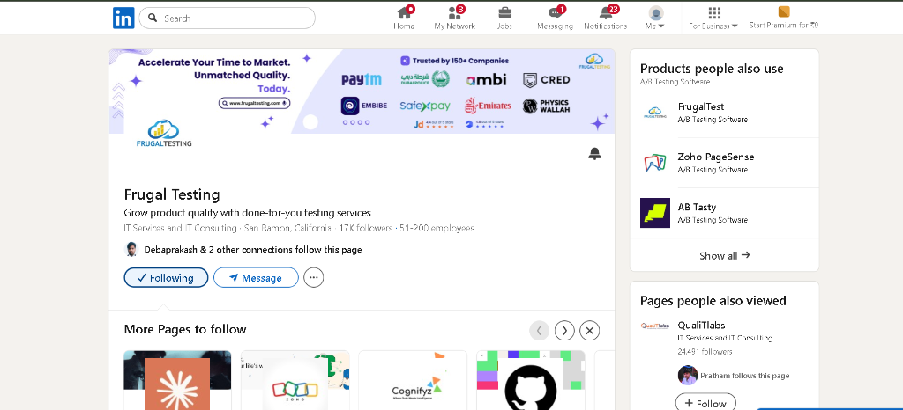
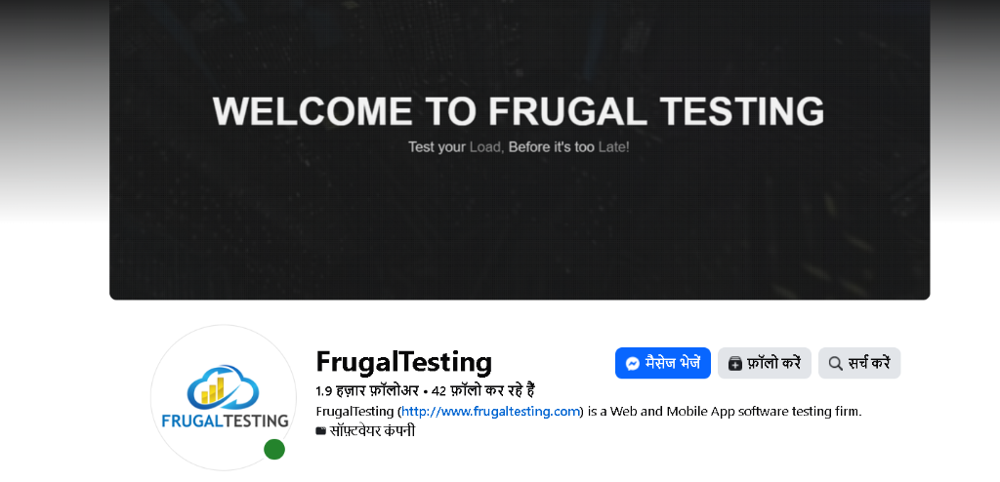
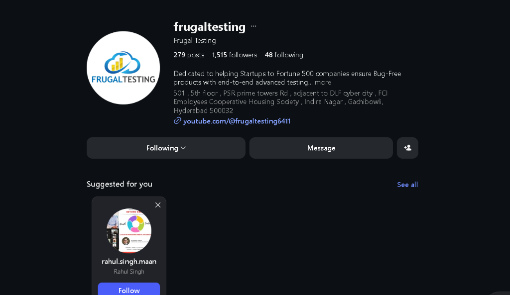
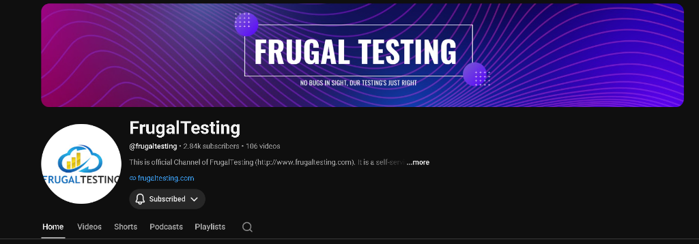

# Technical Portfolio & Video CV Presentation Script

## Q22. Profile & Technical Portfolio Compilation

### 1. Professional Credentials & Links
- **Full Name**: Abhay Kumar Singh
- **LinkedIn Profile Link**: [linkedin.com/in/abhaykumarsingh7006](https://www.linkedin.com/in/abhaykumarsingh7006)
- **Resume Download Link (PDF)**: [Resume Download](https://drive.google.com/file/d/1wx99aJLgOe4ocaWJSPaOuYOEhHNoFJPN/view?usp=sharing)
- **Technical Repositories & Profiles**: 
  - GitHub: [github.com/Abhay52004](https://github.com/Abhay52004)
  - LeetCode: [leetcode.com/u/Sanger_70/](https://leetcode.com/u/Sanger_70/)
- **Outstanding System Projects**:
  - *Playwright Advanced Interceptor*: Distributed WebSocket Jitter and Fault Injection test harness.
  - *Zero-Trust MCP Sandbox Proxy*: Secure token-limited logger interface for LLM command isolation.

### 2. Social Engagement Proof
- **LinkedIn Page followed**: [Frugal Testing LinkedIn](https://www.linkedin.com/company/frugaltesting/)
  
- **Facebook Page followed**: [Frugal Testing Facebook](https://www.facebook.com/FrugalTest)
  
- **Instagram Page followed**: [Frugal Testing Instagram](https://instagram.com/frugaltesting)
  
- **YouTube Channel followed**: [Frugal Testing YouTube](https://www.youtube.com/channel/UCjikgYGfeqU4ZPKQNm1V5tg/featured)
  
- **Website Visited**: [Frugal Testing Website](https://frugaltesting.com/)
  

---

## Q23. Video Evaluation Presentation (Video CV Link)
**Google Drive Link**: [https://drive.google.com/drive/folders/10ro-H21sjYVDelSBwqWYCkcoHqP9r9is?usp=sharing](https://drive.google.com/drive/folders/10ro-H21sjYVDelSBwqWYCkcoHqP9r9is?usp=sharing)

